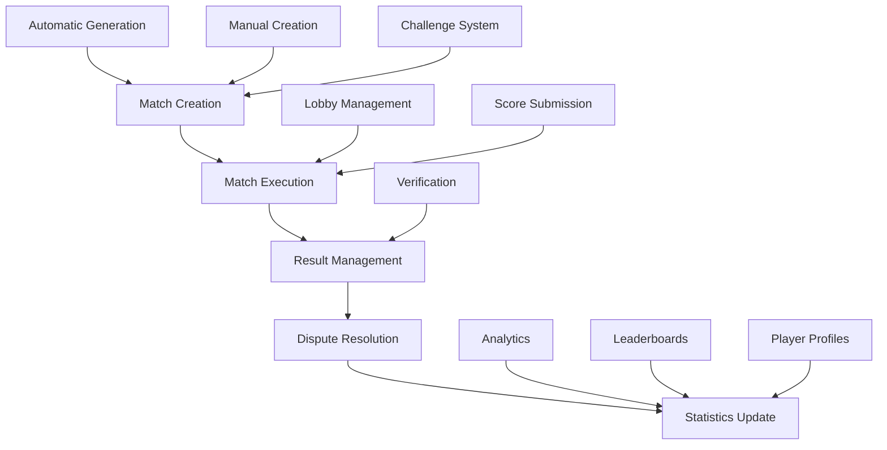

# Match System Overview

The Match System is the operational core of the Mettlestate Tournament Platform, handling the creation, execution, and management of individual competitive matches across all tournament formats and game types.

## System Architecture

### Core Components

The match system consists of several interconnected components that work together to provide a seamless competitive experience:



### Key Features

- **Multi-Format Support**: Best-of series, single games, group matches, elimination matches
- **Automated Generation**: Intelligent match creation based on tournament formats
- **Challenge System**: Player and team-initiated competitive matches
- **Real-Time Execution**: Live match management and result tracking
- **Comprehensive Verification**: Score validation and dispute resolution
- **Performance Analytics**: Detailed statistics and performance tracking

## Match Creation

### Automatic Match Generation

The system automatically generates matches based on tournament configurations and participant data:

#### Bracket-Based Creation
- **Tournament Bracket Generation**: [PLACEHOLDER: Document bracket creation algorithm]
- **Seeding System**: [PLACEHOLDER: Document how players are seeded]
- **Bye Handling**: [PLACEHOLDER: Document if byes are given to top seeds]
- **Bracket Balancing**: [PLACEHOLDER: Document if brackets are automatically balanced]

#### Group Stage Generation
- **Group Formation**: [PLACEHOLDER: Document group creation algorithm]
- **Group Seeding**: [PLACEHOLDER: Document if groups are seeded by skill]
- **Group Balancing**: [PLACEHOLDER: Document if groups are automatically balanced]
- **Group Size Optimization**: [PLACEHOLDER: Document optimal group sizes]

#### Round Robin Scheduling
- **Match Pairing**: [PLACEHOLDER: Document round robin pairing algorithm]
- **Schedule Optimization**: [PLACEHOLDER: Document if matches are optimized for time]
- **Conflict Resolution**: [PLACEHOLDER: Document how scheduling conflicts are resolved]
- **Fair Rotation**: [PLACEHOLDER: Document if players rotate through different time slots]

#### Swiss System Pairing
- **Rating-Based Pairing**: [PLACEHOLDER: Document how players are paired by rating]
- **Pairing Algorithm**: [PLACEHOLDER: Document specific Swiss pairing method]
- **Rating Updates**: [PLACEHOLDER: Document if ratings are updated after each round]
- **Pairing Constraints**: [PLACEHOLDER: Document if certain pairing restrictions exist]

### Manual Match Creation

Administrators and tournament organizers can create custom matches for various purposes:

#### Admin-Created Matches
- **Admin Interface**: [PLACEHOLDER: Document admin match creation tools]
- **Match Customization**: [PLACEHOLDER: Document what can be customized]
- **Override Capabilities**: [PLACEHOLDER: Document if admins can override automatic generation]
- **Emergency Matches**: [PLACEHOLDER: Document if emergency match creation exists]

#### Exhibition Matches
- **Exhibition Purpose**: [PLACEHOLDER: Document what exhibition matches are for]
- **Scoring System**: [PLACEHOLDER: Document if exhibition matches have different scoring]
- **Participant Selection**: [PLACEHOLDER: Document how exhibition participants are chosen]
- **Result Handling**: [PLACEHOLDER: Document if exhibition results affect rankings]

#### Practice Matches
- **Practice Purpose**: [PLACEHOLDER: Document what practice matches are for]
- **Result Tracking**: [PLACEHOLDER: Document if practice results are recorded]
- **Skill Assessment**: [PLACEHOLDER: Document if practice matches affect skill ratings]
- **Team Practice**: [PLACEHOLDER: Document if team practice matches exist]

### Challenge System

The platform supports player and team-initiated competitive matches:

#### Player Challenges
- **Challenge Initiation**: [PLACEHOLDER: Document how players initiate challenges]
- **Challenge Targeting**: [PLACEHOLDER: Document how challenge targets are selected]
- **Challenge Messaging**: [PLACEHOLDER: Document if challenges include messages]
- **Challenge Visibility**: [PLACEHOLDER: Document if challenges are public or private]

#### Team Challenges
- **Team Challenge Process**: [PLACEHOLDER: Document how team challenges work]
- **Team Member Approval**: [PLACEHOLDER: Document if team challenges need member approval]
- **Challenge Coordination**: [PLACEHOLDER: Document how team challenges are coordinated]
- **Result Distribution**: [PLACEHOLDER: Document how team challenge results are distributed]

#### Challenge Management
- **Challenge Limits**: [PLACEHOLDER: Document if there are challenge frequency restrictions]
- **Concurrent Challenges**: [PLACEHOLDER: Document if multiple challenges can be active]
- **Challenge Cooldowns**: [PLACEHOLDER: Document if there are challenge cooldown periods]
- **Challenge Expiration**: [PLACEHOLDER: Document if challenges expire after a certain time]

### Scheduling Algorithms

Intelligent algorithms ensure optimal match scheduling and fair competition:

#### Skill-Based Matching
- **Skill Assessment**: [PLACEHOLDER: Document how player skill is assessed]
- **Rating Systems**: [PLACEHOLDER: Document what rating systems are used]
- **Skill Balancing**: [PLACEHOLDER: Document if matches are balanced by skill]
- **Skill Progression**: [PLACEHOLDER: Document if skill ratings change over time]

#### Availability Matching
- **Time Preferences**: [PLACEHOLDER: Document how player time preferences are handled]
- **Schedule Optimization**: [PLACEHOLDER: Document if schedules are optimized for availability]
- **Conflict Avoidance**: [PLACEHOLDER: Document if scheduling conflicts are avoided]
- **Timezone Coordination**: [PLACEHOLDER: Document how timezones are coordinated]

#### Geographic Optimization
- **Regional Grouping**: [PLACEHOLDER: Document if players are grouped by region]
- **Geographic Preferences**: [PLACEHOLDER: Document if players can set geographic preferences]
- **Server Optimization**: [PLACEHOLDER: Document if server locations are optimized]
- **Latency Considerations**: [PLACEHOLDER: Document if network latency is considered]

## Match Execution

### Lobby Management

Comprehensive lobby system for match coordination and execution:

#### Game Lobby Creation
- **Lobby Generation**: [PLACEHOLDER: Document how game lobbies are created]
- **Lobby Configuration**: [PLACEHOLDER: Document what lobby settings can be configured]
- **Lobby Templates**: [PLACEHOLDER: Document if lobby templates exist]
- **Lobby Customization**: [PLACEHOLDER: Document how lobbies can be customized]

#### Lobby Codes
- **Code Generation**: [PLACEHOLDER: Document how lobby codes are generated]
- **Code Format**: [PLACEHOLDER: Document what format lobby codes use]
- **Code Uniqueness**: [PLACEHOLDER: Document if lobby codes are unique]
- **Code Expiration**: [PLACEHOLDER: Document if lobby codes expire]

#### Password Protection
- **Password Requirements**: [PLACEHOLDER: Document if lobby passwords are required]
- **Password Strength**: [PLACEHOLDER: Document if there are password strength requirements]
- **Password Sharing**: [PLACEHOLDER: Document how lobby passwords are shared]
- **Password Reset**: [PLACEHOLDER: Document if lobby passwords can be reset]

#### Participant Management
- **Player Joining**: [PLACEHOLDER: Document how players join lobbies]
- **Player Removal**: [PLACEHOLDER: Document if players can be removed from lobbies]
- **Player Permissions**: [PLACEHOLDER: Document if players have different permissions in lobbies]
- **Lobby Roles**: [PLACEHOLDER: Document if there are different roles in lobbies]

### Score Submission

Comprehensive system for match result reporting and verification:

#### Player Score Entry
- **Score Input**: [PLACEHOLDER: Document how players input scores]
- **Score Validation**: [PLACEHOLDER: Document if scores are validated]
- **Score Format**: [PLACEHOLDER: Document what format scores use]
- **Score Limits**: [PLACEHOLDER: Document if there are score limits]

#### Screenshot Uploads
- **Screenshot Requirements**: [PLACEHOLDER: Document if screenshots are required]
- **File Formats**: [PLACEHOLDER: Document what file formats are accepted]
- **File Size Limits**: [PLACEHOLDER: Document if there are file size limits]
- **Upload Process**: [PLACEHOLDER: Document how screenshots are uploaded]

#### Result Verification
- **Verification Process**: [PLACEHOLDER: Document how results are verified]
- **Verification Criteria**: [PLACEHOLDER: Document what verification criteria exist]
- **Verification Timing**: [PLACEHOLDER: Document when verification occurs]
- **Verification Results**: [PLACEHOLDER: Document what happens after verification]

### Result Management

Comprehensive handling of match outcomes and statistics:

#### Dispute Handling
- **Dispute Initiation**: [PLACEHOLDER: Document how disputes are initiated]
- **Dispute Evidence**: [PLACEHOLDER: Document what evidence is required for disputes]
- **Dispute Resolution**: [PLACEHOLDER: Document how disputes are resolved]
- **Dispute Outcomes**: [PLACEHOLDER: Document what happens after dispute resolution]

#### Final Confirmation
- **Confirmation Process**: [PLACEHOLDER: Document how final confirmation occurs]
- **Confirmation Requirements**: [PLACEHOLDER: Document what is required for confirmation]
- **Confirmation Timing**: [PLACEHOLDER: Document when confirmation occurs]
- **Confirmation Results**: [PLACEHOLDER: Document what happens after confirmation]

## Match Types

### Best of Series

Comprehensive support for multi-game match formats:

#### Best of 1
- **Single Game**: [PLACEHOLDER: Document how single game matches work]
- **Result Determination**: [PLACEHOLDER: Document how winners are determined]
- **Tie Handling**: [PLACEHOLDER: Document if ties are possible and how they're handled]
- **Time Limits**: [PLACEHOLDER: Document if there are time limits for single games]

#### Best of 3
- **Three Game Series**: [PLACEHOLDER: Document how three game series work]
- **Series Progression**: [PLACEHOLDER: Document how series progress through games]
- **Series Completion**: [PLACEHOLDER: Document when series are considered complete]
- **Series Scoring**: [PLACEHOLDER: Document how series scores are calculated]

#### Best of 5
- **Five Game Series**: [PLACEHOLDER: Document how five game series work]
- **Series Structure**: [PLACEHOLDER: Document how five game series are structured]
- **Series Completion**: [PLACEHOLDER: Document when five game series are complete]
- **Series Advantages**: [PLACEHOLDER: Document if there are advantages in five game series]

#### Best of 7
- **Seven Game Series**: [PLACEHOLDER: Document how seven game series work]
- **Series Structure**: [PLACEHOLDER: Document how seven game series are structured]
- **Series Completion**: [PLACEHOLDER: Document when seven game series are complete]
- **Series Advantages**: [PLACEHOLDER: Document if there are advantages in seven game series]

#### Custom Series
- **Custom Lengths**: [PLACEHOLDER: Document if custom series lengths are allowed]
- **Custom Rules**: [PLACEHOLDER: Document if custom series have special rules]
- **Custom Scoring**: [PLACEHOLDER: Document if custom series have different scoring]
- **Custom Completion**: [PLACEHOLDER: Document how custom series completion is determined]

### Additional Match Types

#### Single Game
- **Single Match**: Individual game sessions
- **Quick Play**: Fast-paced competitive matches
- **Practice Mode**: Skill development sessions
- **Exhibition**: Non-competitive showcase matches
- **Special Events**: Unique match formats

#### Group Matches
- **Round Robin**: All-play-all group competition
- **Group Standings**: Group ranking and progression
- **Advancement Criteria**: Group-to-bracket progression
- **Tie-Breaking**: Group ranking resolution
- **Group Management**: Group administration tools

#### Elimination Matches
- **Single Elimination**: Knockout competition
- **Double Elimination**: Second chance brackets
- **Losers Bracket**: Extended competition opportunity
- **Consolation Rounds**: Placement determination
- **Final Placement**: Complete ranking system

## Technical Implementation

### Match Data Structure

```typescript
interface Match {
    id: string;
    tournamentId: string;
    matchType: MatchType;
    participants: MatchParticipant[];
    status: MatchStatus;
    lobbyCode?: string;
    lobbyPassword?: string;
    startTime: Date;
    endTime?: Date;
    results?: MatchResult[];
    disputes?: MatchDispute[];
    metadata: MatchMetadata;
}
```

### Match Creation Flow

```typescript
const createMatch = async (matchData: MatchCreationData) => {
    // Validate match data
    const validatedData = validateMatchData(matchData);
    
    // Generate lobby information
    const lobbyInfo = generateLobbyInfo(validatedData);
    
    // Create match record
    const match = await createMatchRecord({
        ...validatedData,
        ...lobbyInfo,
        status: 'scheduled'
    });
    
    // Notify participants
    await notifyParticipants(match);
    
    return match;
};
```

### Result Processing

```typescript
const processMatchResult = async (matchId: string, result: MatchResult) => {
    // Validate result data
    const validatedResult = validateResult(result);
    
    // Update match status
    await updateMatchStatus(matchId, 'completed');
    
    // Process statistics
    await updatePlayerStatistics(matchId, validatedResult);
    
    // Handle disputes if any
    if (validatedResult.disputed) {
        await createDispute(matchId, validatedResult);
    }
    
    // Update tournament progress
    await updateTournamentProgress(matchId);
};
```

## Integration Points

### Internal Systems

- **Tournament Management**: Match generation and tournament progression
- **Player Management**: Player statistics and performance tracking
- **Team Management**: Team-based match participation
- **Notification System**: Match updates and reminders
- **Analytics Engine**: Performance data collection and analysis

### External Services

- **Game Platforms**: Game-specific integration and verification
- **Communication Tools**: Match coordination and updates
- **Analytics Services**: Performance tracking and reporting
- **Social Media**: Match result sharing and promotion
- **Streaming Platforms**: Match broadcast integration

## Performance & Scalability

### Optimization Features

- **Match Caching**: Frequently accessed match data caching
- **Batch Processing**: Efficient bulk match operations
- **Background Jobs**: Asynchronous match processing
- **Database Optimization**: Optimized match queries and indexing
- **CDN Integration**: Global match data delivery

### Scaling Capabilities

- **Horizontal Scaling**: Multi-instance match processing
- **Load Distribution**: Automatic match load balancing
- **Database Sharding**: Match data distribution support
- **Microservice Ready**: Match service decomposition support
- **Real-Time Updates**: Live match status synchronization

## Security & Fair Play

### Match Integrity

- **Result Verification**: Comprehensive score validation
- **Dispute Resolution**: Fair conflict handling
- **Anti-Cheating**: Cheat detection and prevention
- **Audit Logging**: Complete match activity tracking
- **Fair Play Enforcement**: Conduct monitoring and penalties

### Access Control

- **Participant Verification**: Authentic player participation
- **Lobby Security**: Secure match access control
- **Result Protection**: Secure score submission and storage
- **Admin Oversight**: Administrative match management
- **Permission Management**: Role-based match access

---

This overview provides a comprehensive understanding of the match system. For detailed implementation information, explore the specific sections on Match Creation, Match Execution, and Match Types as they become available.
